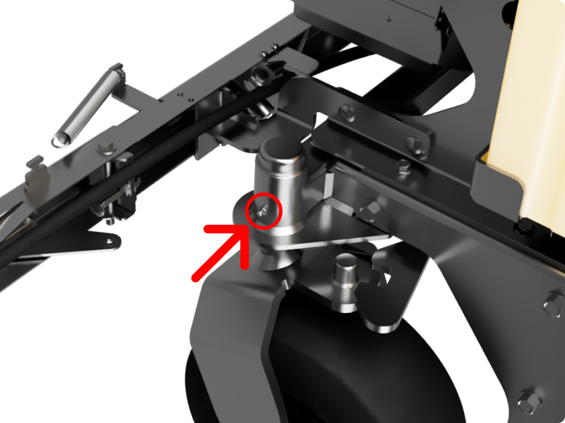

The bearings at the front casters are the only place where regular application of grease is required on the GR96. 

_Location of the grease port on the front caster_

We recommend a NLGI #2, general purpose and water-proof grease for the front casters. Top off grease monthly.