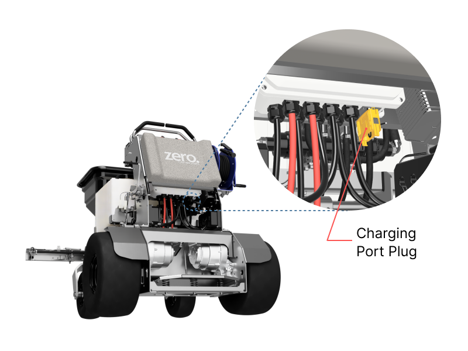

Charging the GR-96 is almost as easy as charging your phone. Simply plug the charger into a standard 110V outlet, and plug the other end of the charger into the charging port on the GR-96. The time it takes to fully recharge will depend on how far the batteries are depleted, plus other environmental factors. However full recharge on a two-battery version should never take more than 6 hours.

### Charging Port on GR-96

The charging port is located below the hip cushion. 

First, remove the dummy plug that is in the charging port by squeezing the metal tabs and pullling it. 

Then, insert the charger plug until you hear a click from each of the two metal tabs.

### How to tell if the battery is being charged

There are two ways to see the status of charging.

1. Light indicator on the battery charger. The LED light will light green while the battery is being charged. The LED will turn off once the battery is fully charged.
2. Look at the battery monitor on the dashboard. You can scroll through the menu using the up or down buttons on the battery monitor until you see the current reading (unit is "A"). When battery is being charged, the current reading should be greater than zero. 