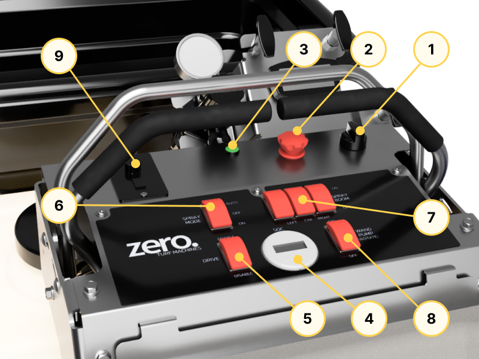
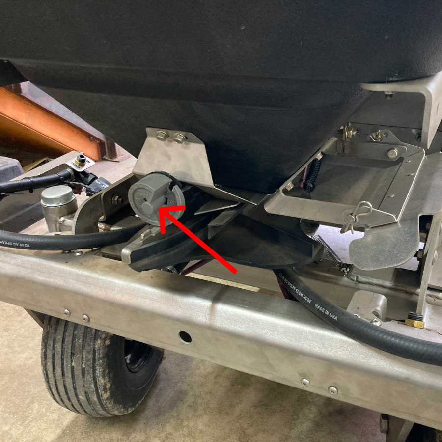
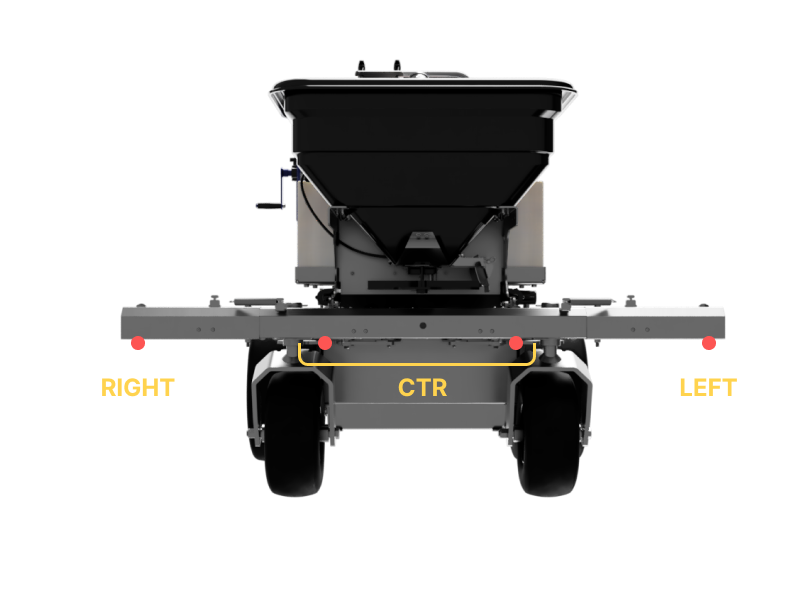

## Dashboard

1. [Ignition Key](#ignition-key)
2. [E-Stop](#e-stop)
3. [LED Status Indicator](#led-status-indicator)
4. [Battery Monitor Display](#battery-monitor-display)
5. [Drive Enable Switch](#drive-enable-switch)
6. [Spray Mode Switch](#spray-mode-switch)
7. [Spray Shutoff Switches (LEFT/CTR/RIGHT)](#spray-shutoff-switches)
8. [Wand Pump Switch](#wand-pump-switch)
9. [Hopper Motor Control](#hopper-motor-control)

10. [Pressure Gauge](#pressure-gauge)
11. [Pressure Adjust Dial](#pressure-adjust-dial)
12. [Hopper Gate Open/Close](#hopper-gate-openclose)
13. [Hopper Gate Opening Adjustment](#hopper-gate-opening-adjustment)
14. [Hopper Deflector Adjustment](#hopper-deflector-adjustment)
15. [Speedometer](#speedometer)

16. [Hopper Rate Adjust Dial](#hopper-rate-adjust-dial) (Above)

### Ignition Key

This is the primary ON/OFF switch for the GR96. The key can be removed for security.

### E-Stop

Emergency stop switch. Pressing it will immediately disable all drive functions. 

To release, rotate the switch counterclockwise.

### LED Status Indicator

Indicates the machine state. Refer to [Machine State](/operations/machine-state/) for further details.

### Battery Monitor Display

Displays various information regarding the battery, such as:

* Battery voltage
* Battery State of Charge
* Battery Current

### Drive Enable Switch

Enables or disables the drive motors.

### Spray Mode Switch

Toggles the boom spray modes. Refer to the [Sprayer Operations](/operations/sprayer/) for further details.

### Spray Shutoff Switches

Opens or closes the respective boom spray nozzles as desired. Each of the LEFT-CTR-RIGHT switches control the following nozzles:

### Wand Pump Switch

When switched ON, the sprayer pump is turned on and the handheld spray gun can be used by squeezing its trigger.

### Hopper Motor Control

Switch ON/OFF the hopper motor as well as control its rotation speed.

### Pressure Gauge

Indicates the pressure of the sprayer system.

### Pressure Adjust Dial

Use this to adjust the sprayer system pressure.

### Hopper Gate Open/Close

Starts or shuts off the flow of the hopper material. To control the material spread rate when the gate is opened, use the [adjust dial](#hopper-rate-adjust-dial) located on the front of the hopper.

### Hopper Diffuser

Use this to adjust the spread of the hopper material.

### Hopper Deflector Adjustment

Use this to limit the spread of the hopper material on the left side of the vehicle's moving direction.

### Speedometer

Displays the current vehicle speed, cumulative drive distance (odometer), and the current ambient temperature.

### Hopper Rate Adjust Dial 

Control the amount of gate opening when the hopper gate is opened.