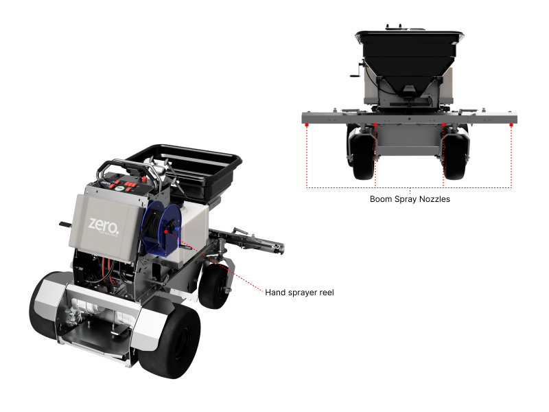
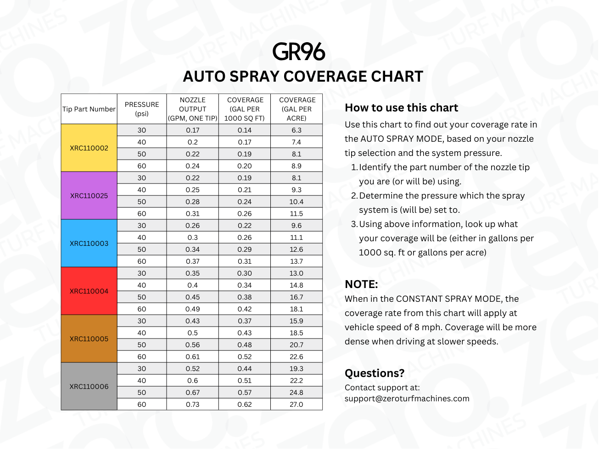
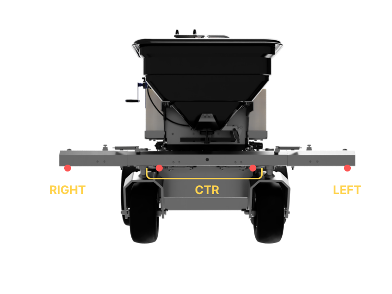
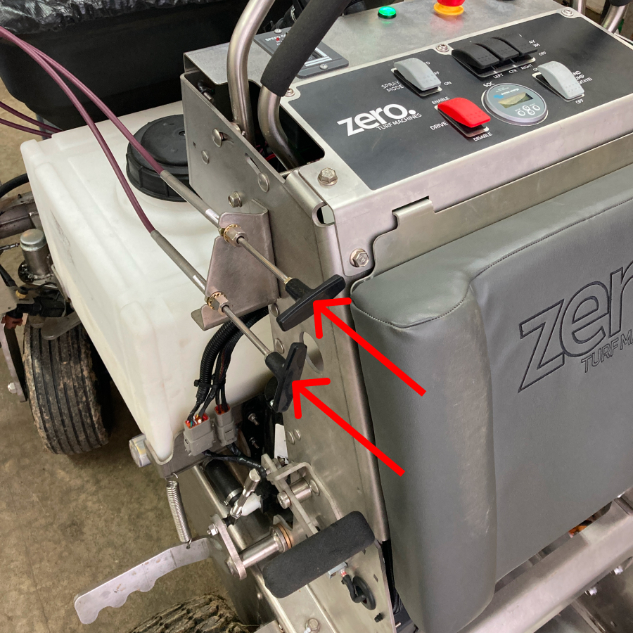
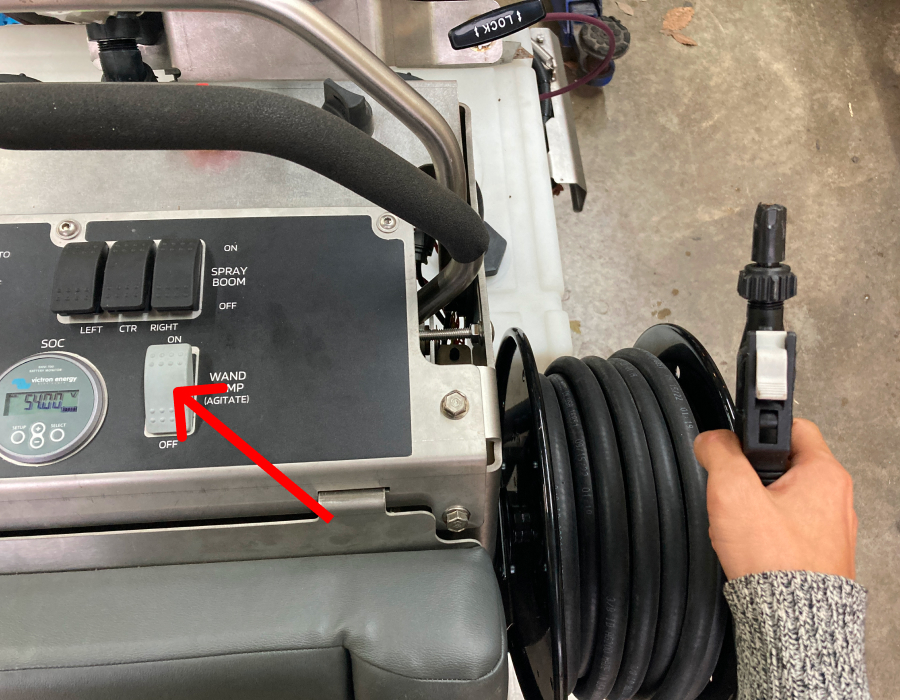

import { Aside } from '@astrojs/starlight/components';

## Spray Boom

The GR96 has four spray nozzles on the boom for liquid application. There is also a handheld spray gun, mounted on the right side of the machine.

### Boom Spray Modes

There are two possible modes for the boom spray:

#### 1. Auto Spray

In the AUTO SPRAY mode, the spray will come on only while the machine is moving to avoid overspraying. Additionally, the spray nozzle output will automatically adjust to the vehicle speed to ensure a constant coverage rate.

The coverage rate is dependent upon the choice of nozzle tip as well as the spray system pressure. Use the chart below to find out the coverage rate in your setting, or to help you choose the appropriate tip for your application.

<Aside type="note" title="Quick Tip">
There is also a foot switch which can be used to interrupt the spray when desired. This can be useful when spot-spraying.
</Aside>

#### 2. Constant Spray

At the ON position, the boom sprayer nozzles will open fully regardless of vehicle speed. 

The foot switch interrupt is active in this mode as well.

### Spray Zones

You can also control which of the four boom sprayer nozzles are active. This will allow you to spray only on one side of the travel path, etc.

On the top-right side of the dashboard, there are three toggle switches for SPRAY BOOM. The LEFT, CTR, and RIGHT switches corresponds to the valves for the respective nozzles. Here CTR corresponds to the two center nozzles. Use these switches to control which nozzles are active. 

<Aside type="caution" title="Caution">
  When using the boom spray, make sure that at least one of LEFT/CTR/RIGHT valves are opened to avoid building up excessive pressure in the system.
</Aside>

### Extending/Retracting the Boom

The spray boom extensions on the GR96 can be retracted or extended from the cockpit using the push-pull cable handles located on the left side of the dashboard.

## Handheld Sprayer

To use the handheld sprayer, simply turn ON the WAND PUMP switch on the right side of the dashboard.

