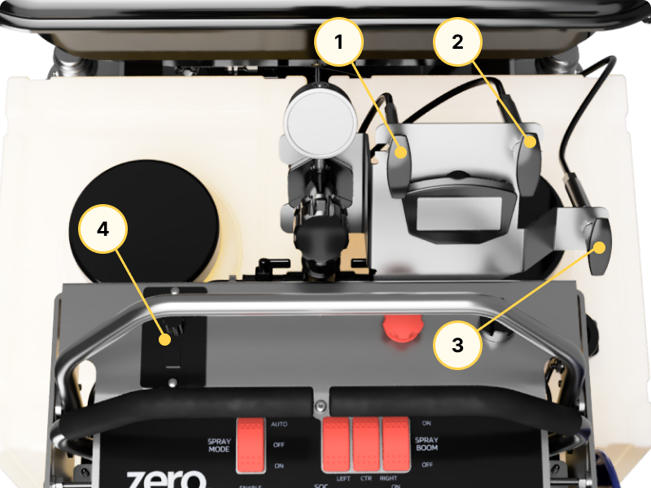
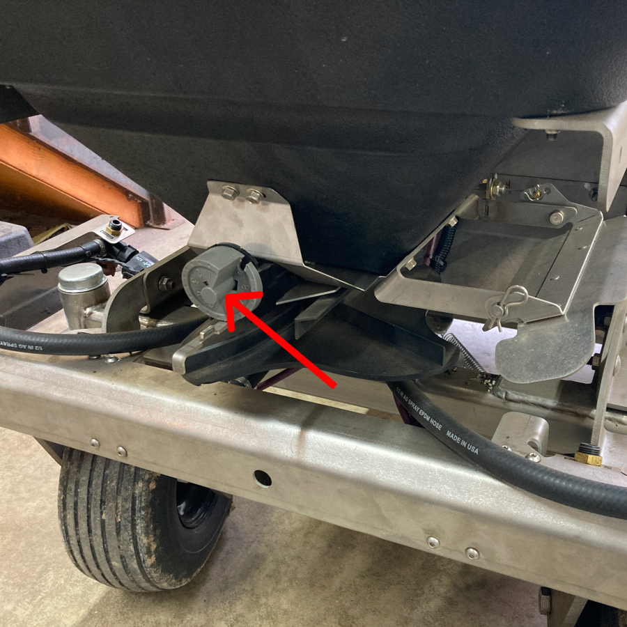

import { Aside } from '@astrojs/starlight/components';

<Aside type="caution" title="Caution">
  Ensure that the hopper motor is turned off before making any adjustment to the hopper system.
</Aside>

## Spreader Operation

To operate the spreader system, you will use:

* The three push-pull cables near the spedometer,
* The rate adjust dial at the front of the hopper, and
* The hopper motor controller

1. Gate Open/Close
2. Spread Pattern Control
3. Deflector
4. Hopper Motor Controller

_Above: Hopper Rate Adjust Dial_

To begin spreading the product,

1. Turn on the hopper motor (#4 above)
2. Open the hopper gate (#1 above)

To adjust how, and how much product is spread, refer to the next section.

## Spreader Adjustments

Overall spread rate is controlled by the rate adjust dial at the front of the hopper. 

<Aside type="caution" title="Caution">
  Make sure that the machine is powered off before adjusting the rate adjust dial.
</Aside>

The spread width is controlled by the hopper motor speed dial.

The Spread Pattern Control cable (#2 above) can be used to focus the product spread on the left side, right side, or to spread evenly in all directions.

Finally, use the Deflector (#3 above) to limit the spread on the left side when needed (such as when spreading near the edge of a property).

## Spreader Maintenance

Refer to [this page](/maintenance/spreader) for information on maintaining the spreader and its components.