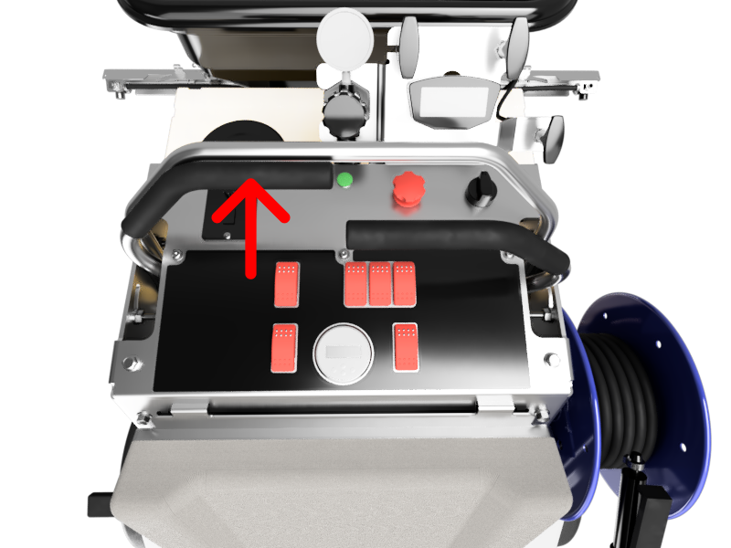
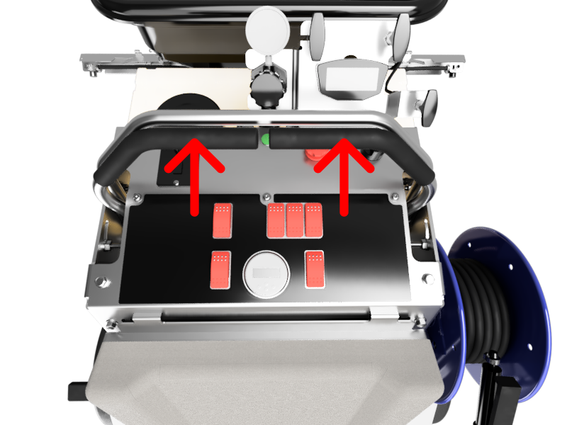
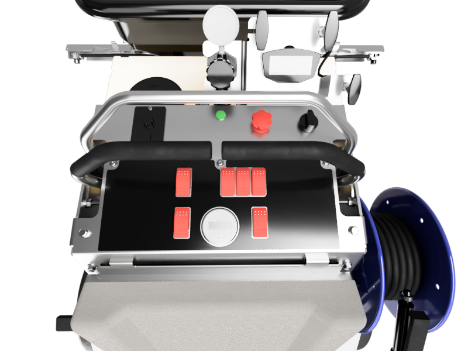
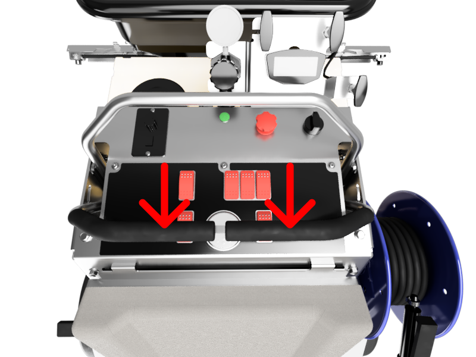

import { Aside, Steps } from '@astrojs/starlight/components';

## Two Types of Calibration

The throttle bars are mechanically centered at factory during its manufacturing process. Additionally, the software onboard the GR96 has a software calibration feature which allows for finer adjustment and to account for minor imperfection in the mechanical calibration.

If the GR96 is becoming more difficult to track straight, we recommend that you perform a software calibration. If the software calibration does not complete successfully, or the machine does not track straight even after software calibration, a mechanical calibration is likely necessary. To have a mechanical calibration done, bring in your GR96 to an authorized service dealer. [Contact us](/reference/contact) to find out who can perform this service for you, if you are not sure.

## Software Calibration Procedure

<Aside type="note" title="Did you know?">
You can check out a video of this calibration procedure on our <a target="_blank" href="https://www.youtube.com/watch?v=SH9UMEqkuT4">YouTube channel</a>.
</Aside>

The software calibration process is initiated during the startup process. 

<Steps>
1. Start by turning the machine OFF
2. Turn the ignition key to the ON position, then immediately move one of the throttle bars all the way forward.

3. Hold the throttle bar in forward position until you hear a couple of beeps, and the LED indicator alternates betwween green and red. Now you are in calibration mode.
4. First, move both throttle bars all the way forward until you hear a beep, and the LED turns to solid green. 

5. Hold this position until you hear two beeps and the LED changes back to alternate red/green.
6. Next, release the throttle back to neutral. Wait here until you hear two beeps and the LED alternates red/green.

7. Move both throttle bars all the way toward you (reverse position). Hold here until you hear two beeps and the LED alternates red/green.

8. Release both throttle bars to neutral. Wait a few seconds until you hear a single beep and the LED is blinking green.

9. Finished! Now the calibration is complete and the machine is ready to be drive.
</Steps>

<Aside type="caution" title="Caution">
There is approximately a 3-second window to perform the maneuver to enter calibration, starting when you turn the ignition to ON. If you wait too long, machine will enter PARK mode, at which point moving the throttle will move the machine! If the LED is green, it is in a drivable mode and therefore too late to enter calibration. You can turn off the ignition and on again, to attempt entering the calibration mode again. 
</Aside>
