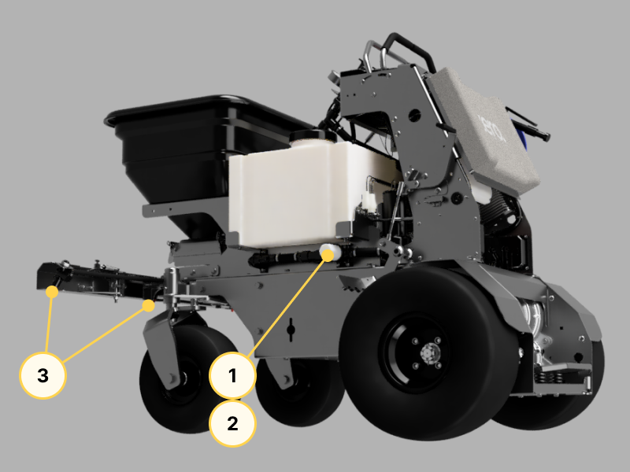
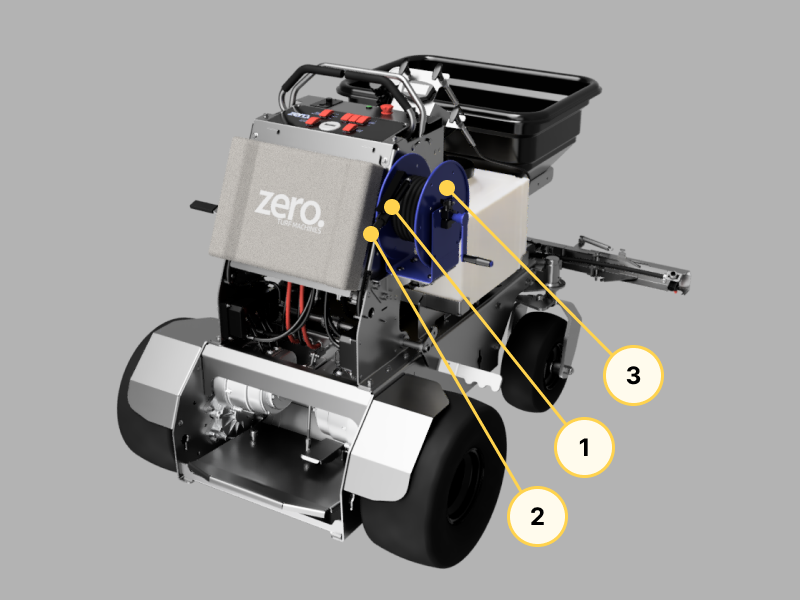
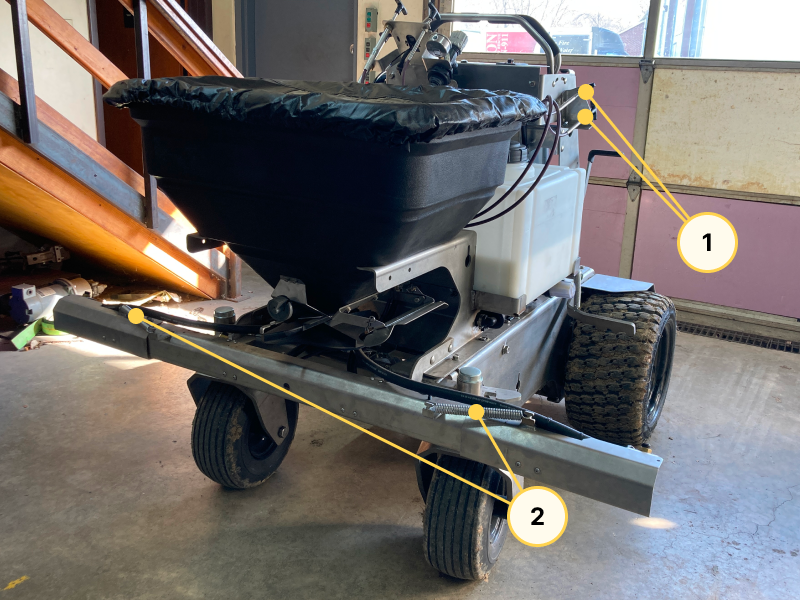
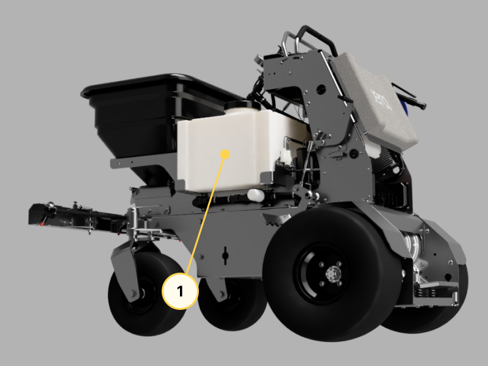
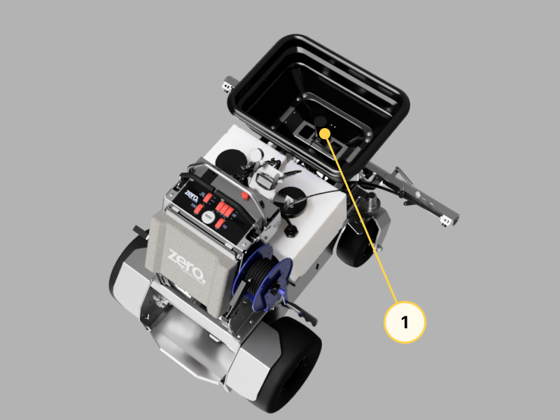
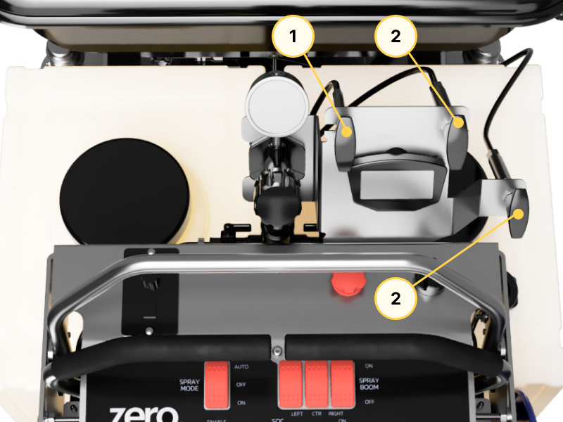
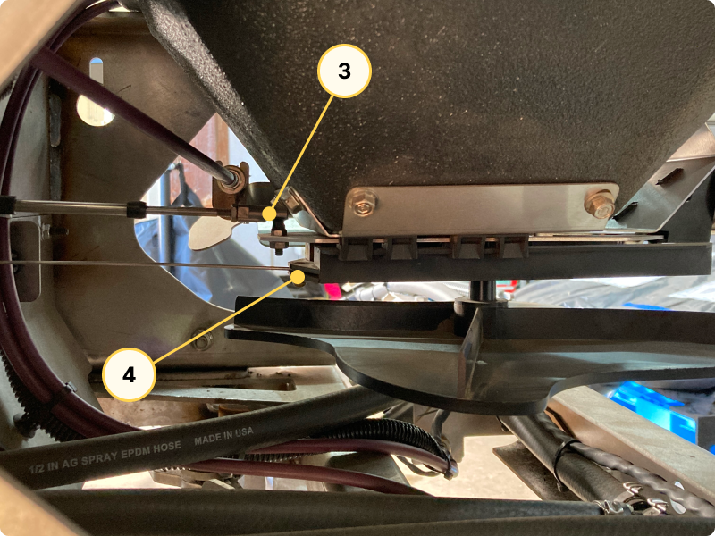
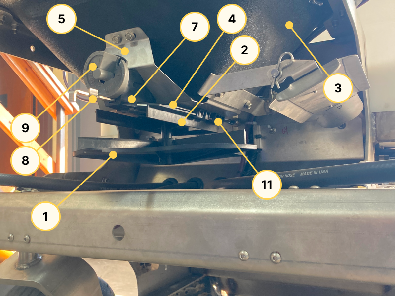

## Spray System

### Filters and Gaskets

1. GASKET, EPDM, 1/8" [LSTM050G]
2. STRAINER, 80 MESH [ST580]
3. STRAINER WITH CHECK VALVE, 50 MESH [4193B-PP-5-50SS]

### Handheld Spray Gun

1. SPRAY GUN, 3/8" HOSE [22650-PP-406]
2. ADJUSTABLE SPRAY TIP [5500-PPB-X18]
3. REEL [112-3-50]

### Spray Boom

1. UTILITY CABLE [X100-3427-084]
2. EXTENSION SPRING [1942N816]

### Tank

1. SPRAYER TANK, 12 GALLON [SP0012-RT]

## Spreader System

### Hopper Motor

1. MOTOR, HOPPER [K01623-224021]

### Hopper Control

1. UTILITY CABLE [X100-3227-048]
2. UTILITY CABLE, TWIST TO LOCK [X073-33092-048]
3. BALL JOINT LINKAGE [6058K35]
4. WIRE STOP [30103]
5. PIVOT [39011-1]

### Hopper

1. SPINNER, HOPPER [1000607]
2. DIFFUSER, HOPPER [1000740]
3. HOPPER, 220LB [1000867] 
4. GATE, HOPPER [1008244]
5. HOPPER BOTTOM PLATE 220LB [1020528]
6. BOTTOM BEARING, HOPPER [1000203]
7. DIAL MOUNT, HOPPER [1000211]
8. RATE GATE LINKAGE, HOPPER [1000725]
0. DIAL, HOPPER [1000733]
10. AGITATOR WIRE, HOPPER [1005189]
11. GUIDE, RATE GATE, HOPPER [1001521]