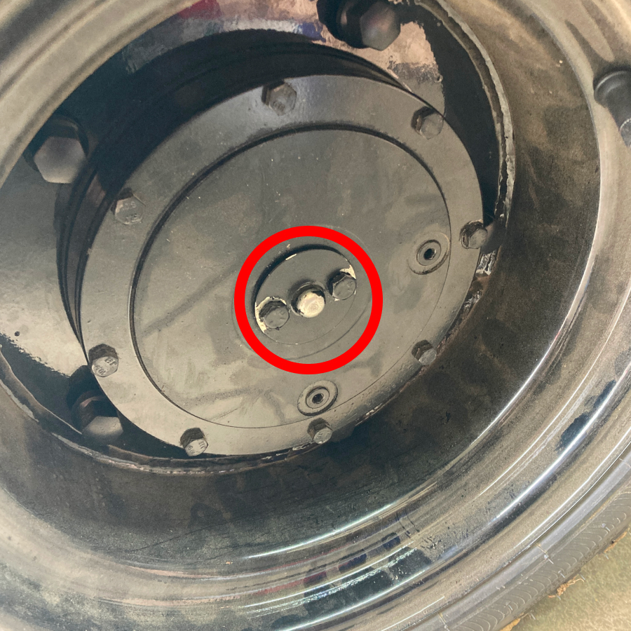
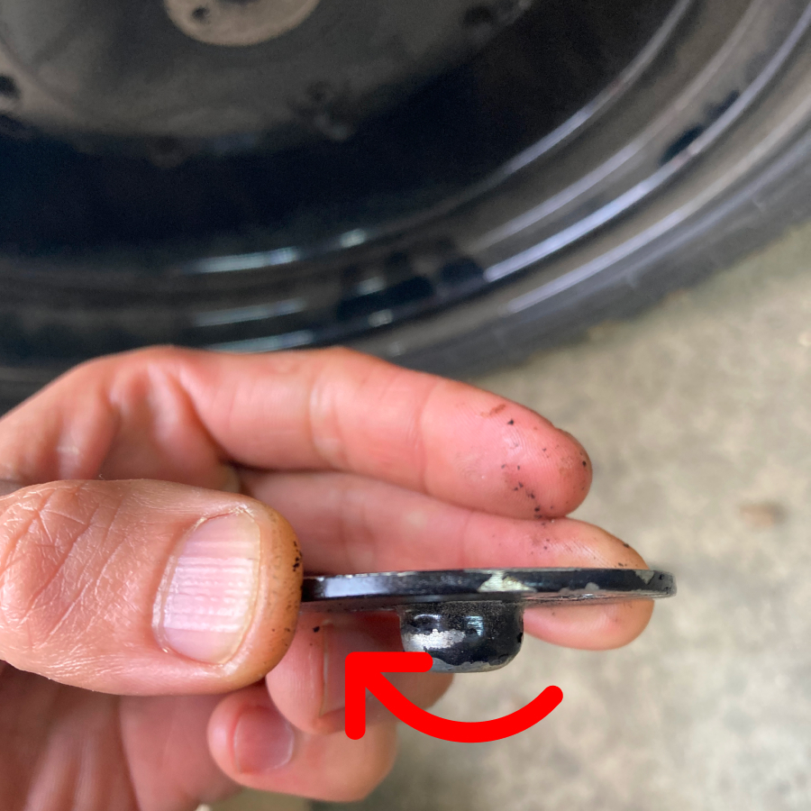
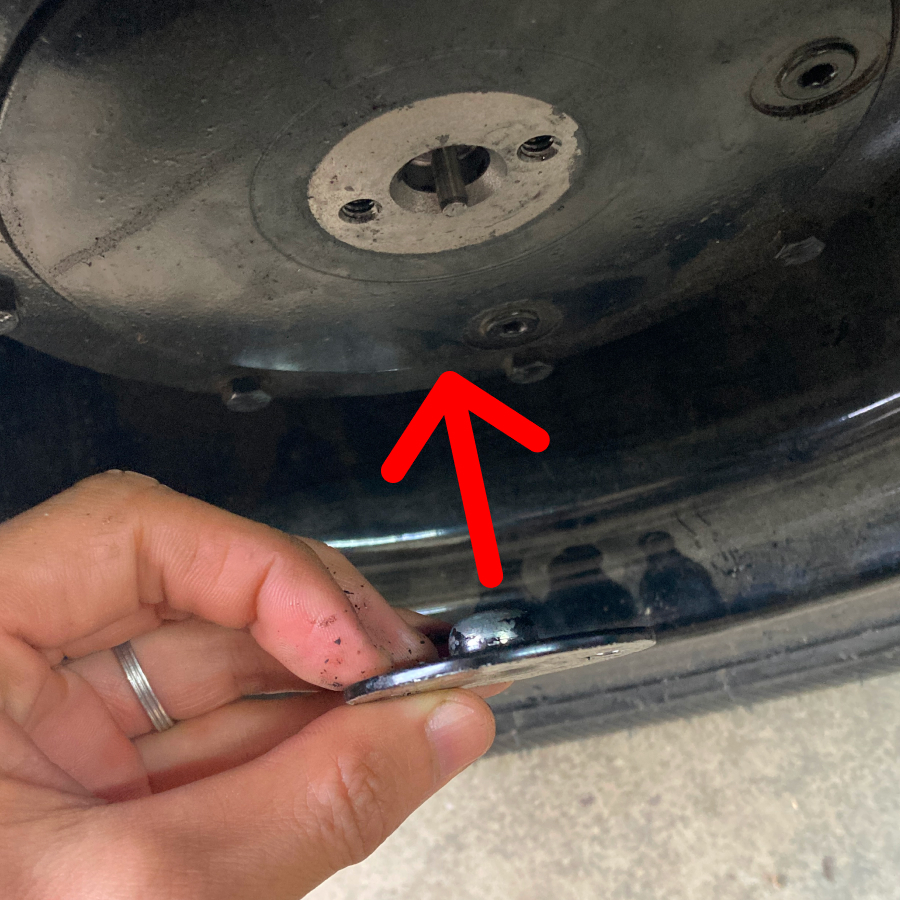

import { Aside, Steps } from '@astrojs/starlight/components';

<Aside type="caution" title="Caution">
In order to avoid the risk of fully depleting the battery, we recommend that the SoC (State of Charge) is always kept at or above 30%.
</Aside>

<Aside type="note" title="Tip">
Before the battery is fully depleted, you will notice that the machine has become less responsive (especially up a hill). If this happens, immediately plug the machine to a charger.
</Aside>

## What to do if the batteries are dead?

Because the GR96 with full charge has enough battery capacity to handle well over a full day's worth of spraying/spreading, you should never experience a dead battery during an application. Just make sure that the machine is fully charged to start the day, by plugged in overnight prior to use.

However, in the unlikely scenario that the battery is fully depleted while out in the field and the machine can no longer move, there is a method to unlock the motors and allow you to push or tow the machine.

## How to unlock the motors

<Steps>
1. First, if the machine is on a slope, find a couple of tire wedges and insert them so that the machine is not able to roll away when the locks are released.

2. Find the motor disconnect cap, which is located at the center of the motor when looking at it from outboard side (tire side).
  

3. Using a 7/16" socket, remove the two bolts holding the cap in place.
  

4. Reattach the motor disconnect cap in reverse orientation, inserting the protrusion on the cap into the motor. Tighten the two hex head bolts.
  

5. Perform steps 1 through 3 for both motors. Now the motors are free to rotate.

6. Once you are finished pushing or towing the machine, lock the motors again by removing and mounting the motor disconnect cap in the original orientation.

</Steps>